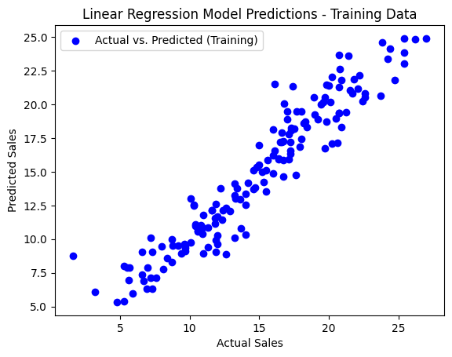
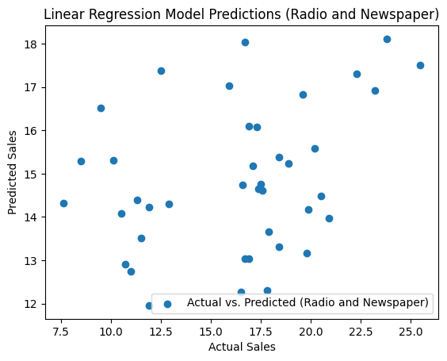

# Sales Prediction Dataset Analysis 📊

## Overview 🌐

This project analyzes the sales prediction dataset, which includes advertising expenditures on TV, Radio, and Newspapers, along with corresponding product sales. The goal is to understand the impact of different advertising mediums on sales and build a predictive model using linear regression.

## Dataset Description 📋

- **Attributes:**
  - `Campaign`: Unique identifier for each advertising campaign
  - `TV`: Advertising expenditure on TV 📺
  - `Radio`: Advertising expenditure on Radio 📻
  - `Newspaper`: Advertising expenditure on Newspaper 📰
  - `Sales`: Product sales (units sold) 📈

## Methodology 🛠️

### Data Preprocessing

1. **Handling Missing Values:**
   - Identified missing values in the dataset.
   - Imputed missing values in the `Radio` column using the mean.

2. **Feature Scaling:**
   - Applied StandardScaler to normalize the feature values for better model performance.

### Analysis and Results 📈

#### Q1: What is the average amount spent on TV advertising in the dataset? 📺

- **Method:** Calculated the mean of the `TV` column.
- **Result:** The average amount spent on TV advertising is **147.04**.

#### Q2: What is the correlation between radio advertising expenditure and product sales? 📻📈

- **Method:** Calculated the Pearson correlation coefficient between `Radio` and `Sales`. Visualized the relationship using a scatter plot.
- **Result:** The correlation between radio advertising expenditure and product sales is **0.35**.

#### Q3: Which advertising medium has the highest impact on sales based on the dataset? 💪

- **Method:** Trained a linear regression model and analyzed the coefficients of `TV`, `Radio`, and `Newspaper`. Identified the medium with the highest coefficient.
- **Result:** The advertising medium with the highest impact on sales is **TV**.

#### Q4: Plot a linear regression line that includes all variables (TV, Radio, Newspaper) to predict Sales, and visualize the model's predictions against the actual sales values 📉

- **Method:** Trained a linear regression model using all three advertising mediums as predictors. Visualized the model's predictions against the actual sales values.
- **Results:**
  - **Training Set Visualization:**  
    

#### Q5: How would sales be predicted for a new set of advertising expenditures: $200 on TV, $40 on Radio, and $50 on Newspaper? 💵

- **Method:** Used the trained linear regression model to predict sales for the given new advertising expenditures.
- **Result:** The predicted sales for the new advertising expenditures are **1039.04** units.

#### Q6: How does the performance of the linear regression model change when the dataset is normalized? 📊

- **Method:** Trained and evaluated the linear regression model on both unnormalized and normalized datasets. Compared the Mean Squared Error (MSE) and R² Score.
- **Results:**
  - **Unnormalized Data:**
    - Mean Squared Error: 2.41
    - R² Score: 0.87
  - **Normalized Data:**
    - Mean Squared Error: 2.41
    - R² Score: 0.87

#### Q7: What is the impact on the sales prediction when only radio and newspaper advertising expenditures are used as predictors? 📉

- **Method:** Trained a linear regression model using only `Radio` and `Newspaper` as predictors. Evaluated the model's performance and visualized the predictions against actual sales values.
- **Results:**
  - Mean Squared Error: 19.08
  - R² Score: 0.01
  - Visualization:  
    

## Conclusion 🎯

The analysis provided insights into the impact of different advertising mediums on product sales. TV advertising had the highest impact on sales, while the correlation between radio advertising expenditure and product sales was moderately positive. The linear regression model demonstrated good performance, and normalization did not significantly affect the results. Using only radio and newspaper as predictors resulted in a significant decrease in model performance.

Done By: Garv Katariya R
Questions By: <a href="https://www.finlatics.com/" target="_blank" >finlatics</a>
